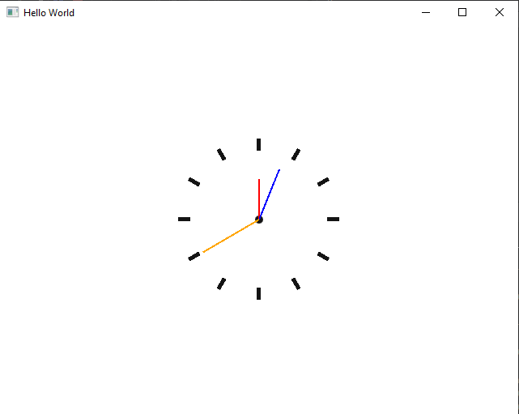

<a name="readme_top"></a>

# QQmlExtensionPlugin-Example
[![Contributors][contributors_shield]][contributors_url]
[![Forks][forks_shield]][forks_url]
[![Stargazers][stars_shield]][stars_url]
[![Issues][issues_shield]][issues_url]
[![Windows Plugin Release][actions_shield]][actions_url]
<br>

## 📑 About the project
Online I found a lot of tutorials from Qt how to create a plugin like this. In my opinion there are too few examples. This is why I created this repository.

I created a Clock in qml with a second-, minute- and hour-clock-hand. This qml can get shipped to a testing-application and imported as a module with `import ClockPlugin 1.0`. For this the plugin-folder has to be in the build-directory of the testing-application.
<p align="right">(<a href="#readme_top">back to top</a>)</p>

## 🎆 Showcase
### Clock inside of the testing-application as plugin

<p align="right">(<a href="#readme_top">back to top</a>)</p>

## 🔢 Getting started
1. Clone the repository
   ```sh
   git clone https://github.com/MhouneyLH/qml_cpp_examples.git
   ```
2. Install [Qt-Creator](https://www.qt.io/offline-installers) and the Qt-Version [6.2.4](https://www.qt.io/offline-installers)
3. Install [MSVC2019](https://visualstudio.microsoft.com/de/downloads/)
4. Use the kit "`Qt 6.2.4 MSVC2019 64bit`", when selecting a kit in Qt-Creator
<p align="right">(<a href="#readme_top">back to top</a>)</p>

## 👨🏻‍💼 Contributing
Contributions are always welcome! Please look at following commit-conventions, while contributing: https://www.conventionalcommits.org/en/v1.0.0/#summary 😃

1. Fork the project.
2. Pick or create an [issue](https://github.com/MhouneyLH/qml_cpp_examples/issues) you want to work on.
2. Create your Feature-Branch. (`git checkout -b feat/best_feature`)
3. Commit your changes. (`git commit -m 'feat: add some cool feature'`)
4. Push to the branch. (`git push origin feat/best_feature`)
5. Open a Pull-Request into the Develop-Branch.
<p align="right">(<a href="#readme_top">back to top</a>)</p>

<!-- Links and Images -->
[contributors_shield]: https://img.shields.io/github/contributors/MhouneyLH/qml_cpp_examples.svg?style=for-the-badge
[contributors_url]: https://github.com/MhouneyLH/qml_cpp_examples/graphs/contributors
[forks_shield]: https://img.shields.io/github/forks/MhouneyLH/qml_cpp_examples.svg?style=for-the-badge
[forks_url]: https://github.com/MhouneyLH/qml_cpp_examples/network/members
[stars_shield]: https://img.shields.io/github/stars/MhouneyLH/qml_cpp_examples.svg?style=for-the-badge
[stars_url]: https://github.com/MhouneyLH/qml_cpp_examples/stargazers
[issues_shield]: https://img.shields.io/github/issues/MhouneyLH/qml_cpp_examples.svg?style=for-the-badge
[issues_url]: https://github.com/MhouneyLH/qml_cpp_examples/issues
[actions_shield]: https://github.com/MhouneyLH/QQmlExtensionPluginExample/actions/workflows/deploy_clock_plugin_and_test_application.yaml/badge.svg
[actions_url]: https://github.com/MhouneyLH/QQmlExtensionPluginExample/actions/workflows/deploy_clock_plugin_and_test_application.yaml